# WeChatPlus  

## 1、介绍  
&emsp;&emsp;WechatPlus是支持PC版微信Wechat的一款辅助工具软件，采用HOOK技术，支持多开、自动回复、群管理、僵尸粉、群发消息、用户数据分析，标签、自动备注，自动绑定手机和标签，自动定时提醒问候用户，自动收款，防撤回等等功能，可以对接企业用户CRM系统，详细功能请参见使用说明，使用场景包括私域运营、客户维护，售后服务等等，所有功能完全免费。
## 2、更新记录  
&emsp;&emsp;2022-9-15 更新到微信最新版 3.7.6.44  
&emsp;&emsp;2022-9-18 增加好友头像功能  
&emsp;&emsp;2022-9-23 优化头像获取方式,增加随机表情设置  
&emsp;&emsp;2022-10-11 增加好友自动打标签功能，解决自动备注和手动绑定手机引起的崩溃  
&emsp;&emsp;2022-10-31 增加随机表情组编辑功能，界面优化  
&emsp;&emsp;2022-11-03 解决手动接受加好友请求引起的崩溃，界面优化  
&emsp;&emsp;2022-11-20 适配微信最新版本3.8.0.27，修复用户反馈的若干问题。  
&emsp;&emsp;2022-11-27 适配微信最新版本3.8.0.41，修复截图、违禁词、黑白名单处理出现的若干BUG。   
&emsp;&emsp;2022-11-28 解决多账号出现的显示问题。  
&emsp;&emsp;2022-11-30 增加工具栏，右侧边栏自动隐藏的功能。  
  
&emsp;&emsp;实时更新中...  
## 3、下载  
&emsp;&emsp;请查看电脑安装的微信版本，下载正确的Wechatplus版本：    
&emsp;&emsp;支持微信最新版本3.8.0.41：    
&emsp;&emsp;下载地址：http://toutiu.com/download/WeChatPlus_3.8.0.41_1.13.rar  
&emsp;&emsp;支持微信微信版本3.8.0.27：    
&emsp;&emsp;下载地址：http://toutiu.com/download/WeChatPlus_3.8.0.27_1.10.rar  
&emsp;&emsp;支持微信版本3.7.6.44：  
&emsp;&emsp;下载地址：http://toutiu.com/download/WeChatPlus_3.7.6.44_1.08.rar  

&emsp;&emsp;下载提示为不安全链接时，请在浏览器下载选项中将此链接设为保留 

&emsp;&emsp;  

&emsp;&emsp;如果下载后安装文件杀毒文件提示报警，请将安装文件添加的杀毒软件的信任区  
## 4、安装&运行  
&emsp;&emsp;1、双击安装程序。Windows Defender警告屏幕可能会弹出，告知该应用程序来自未知来源。单击“更多信息”，然后单击“仍然运行”  
&emsp;&emsp;2、按照安装向导的说明进行操作。您可以选择默认设置。  
&emsp;&emsp;3、如果电脑装有杀毒软件，在安装过程或者安装完成后将报警的文件添加到信任，为避免后续杀毒软件误报，请将wechatplus安装目录和微信的安装目录都及时添加到杀毒软件的信任区   
&emsp;&emsp;4、安装后，应用程序会自动启动。如果没有发生这种情况，请按Windows按钮并开始输入“wechatplus”并选择“wechatplus”。Windows Defender警告屏幕可能会弹出，告知该应用程序来自未知来源。单击“更多信息”，然后单击“仍然运行”。 

## 5、使用说明   
### 多开  
&emsp;&emsp;  
&emsp;&emsp;独有的防检测技术支持多开  
### 随机符号和表情
&emsp;&emsp;为了防止发送相同消息被检测为机器人，自动发送的消息中可以增加随机字符和随机表情，工具栏“更多”选项，跳出来的设置框中选择随机符号标签  
&emsp;&emsp;  
### 自动回复  
&emsp;&emsp;自动回复氛围快捷键回复和关键词回复，工具栏“自动回复”选项，跳出来的设置框中如下：
+    快捷键回复  
&emsp;&emsp;  
点击增加按钮，可以增加相应快捷键回复，回复中可以插入随机字符和表情  
&emsp;&emsp;  
其中的随机字符和随机表情在上文的随机符号中进行设置
+    关键词回复  
&emsp;&emsp;  
点击增加或编辑按钮，可以编辑相应关键词回复  
&emsp;&emsp;  
应用范围：  
1.好友关键词回复：此关键词只能出现在接收的好友消息内容中；  
2.好友关键词：此关键词只能出现在群消息中；  
3.好友关键词：此关键词既能出现在好友消息中，又能出现在群消息中；  
匹配类型：  
1.精确匹配：接受到的消息跟关键词保持一致则触发回复  
2.模糊匹配：接受到的消息内容中含有关键词则触发回复  
### 标签  
+    好友标签  
&emsp;&emsp;对好友进行分类标签，便于群发，查找等  
&emsp;&emsp;  
+    群标签  
&emsp;&emsp;对群进行分类管理  
&emsp;&emsp;  
### 群管理  
&emsp;&emsp;点击工具栏“群管理”选项，进入群管理设置
+    一键拉群  
&emsp;&emsp;  
+    违禁词  
&emsp;&emsp;  
1.对于群主、群管理员以及白名单用户违禁词策略无效，这类型用户没有违禁词。 
2.最多违禁次数：允许单一群成员最多发送的违禁词次数。  
3.处置方式：通过相应的处置方式可以实现自动踢人，群成员发送违禁词对应的四种处置方式:  
&emsp;&emsp;(a)、每次发送警告，到最大次数踢出群  
&emsp;&emsp;(b)、每次发送警告，到最大次数踢出且禁止重新加入  
&emsp;&emsp;(c)、每次只发送警告  
&emsp;&emsp;(d)、不处理  
4.警告语：群成员发送违禁词时，发送的群警告语，可以@群成员，可以加入群成员呢称，也可以加入随机表情  
5.违禁词类型：  
&emsp;&emsp;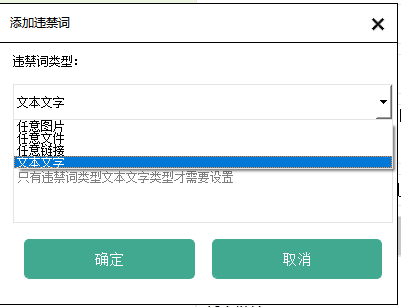  
&emsp;&emsp;(a)、任意图片，发送任意一次图片算一次违禁。  
&emsp;&emsp;(b)、任意文件，发送任意一次文件算一次违禁。  
&emsp;&emsp;(c)、任意链接，发送任意一次链接算一次违禁。  
&emsp;&emsp;(d)、文本文字，发送指定的文字算一次违禁。    
+    黑名单  
&emsp;&emsp;  
&emsp;&emsp;群成员列表中绿色成员为群管理员和白名单用户，不受违禁策略的影响，其余群成员可以鼠标右击，弹出菜单踢出该成员  
&emsp;&emsp;黑名单群成员可以在右边列表中鼠标右击移除
+    白名单  
&emsp;&emsp;  
&emsp;&emsp;绿色成员为群管理员和白名单用户，不受违禁策略的影响，其余群成员可以鼠标右击设为白名单用户。  
+    群欢迎语  
&emsp;&emsp;  
&emsp;&emsp;群欢迎语，可以@群成员，可以加入群成员呢称，也可以加入随机表情  
+    群直播  
&emsp;&emsp;  
&emsp;&emsp;群直播实现的是：在一个主讲群发送的消息，在其他转发群进行自动转发。群直播在设置的时间段才有相应功能。  
### 僵尸粉  
点击工具栏“僵尸粉”选项，进入僵尸粉管理：  
&emsp;&emsp;  
&emsp;&emsp;左边是所有好友列表，右边是查找出来的僵尸风列表，包括被好友删除和被好友拉黑两种类型。  
+    查找僵尸粉  
&emsp;&emsp;1、点击“从所有好友查找”，将对所有好友进行查询。  
&emsp;&emsp;2、点击“从新好友查找”，将只对没查找过的好友进行查询。  
&emsp;&emsp;3、查找过程中右边僵尸粉列表不会刷新，需要关闭此对话框，重新打开才能看到新查找到的僵尸粉。  
&emsp;&emsp;4、查找过程中发送的僵尸粉验证消息，好友不会收到，好友完全无感。   
+    清除僵尸粉  
&emsp;&emsp;点击“开始清理，将会对列表中的僵尸粉用户从通讯录好友列表中删除掉，鼠标右击单个僵尸粉用户可以删除单个僵尸粉。   
### 群发消息  
+    即时群发  
&emsp;&emsp;  
&emsp;&emsp;1、群发消息中可以包括好友呢称，随机表情，随机字符。  
&emsp;&emsp;2、右侧群发好友列表的好友可以按标签选择，也可以按单个好友选择。  
+    定时群发  
&emsp;&emsp;  
&emsp;&emsp;1、定时群发是按计划群发消息，可以创建、编辑、删除相应的计划。  
&emsp;&emsp;2、创建和编辑计划：  
&emsp;&emsp;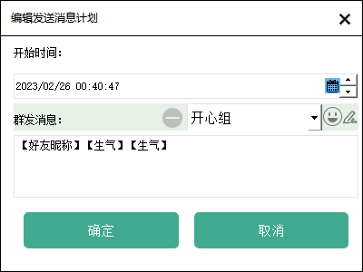  
&emsp;&emsp;1、消息计划中需要设置消息发送时间。规定时间点可以对选择的好友发送相应的消息内容。  
&emsp;&emsp;2、计划发送的消息可以包括好友呢称，随机表情，随机字符。  
### 数据统计  
+    联系人统计  
&emsp;&emsp;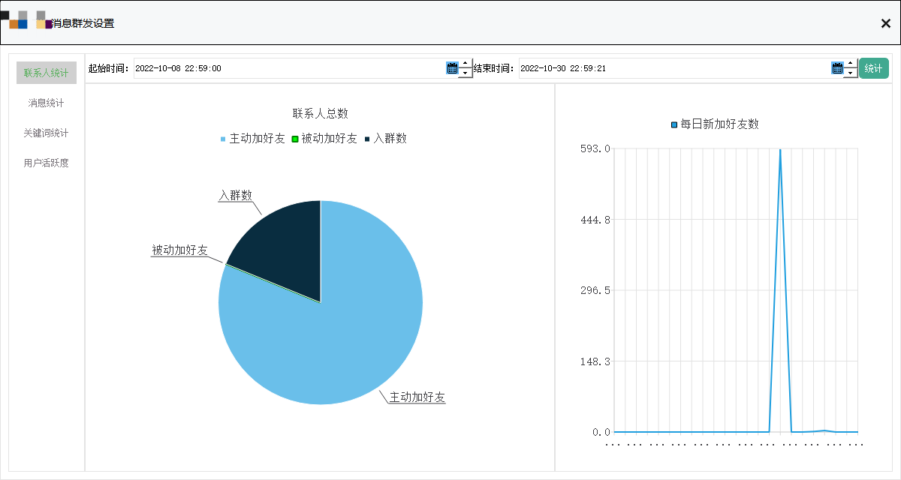 
&emsp;&emsp;1、左边圆形图：联系人总数，包括某个时间段主动加好友，被动加好友和入群数所占比例  
&emsp;&emsp;2、右边折线图：每日新加好友数，指的某个时间段每日新加好友数量  
+    消息统计  
&emsp;&emsp;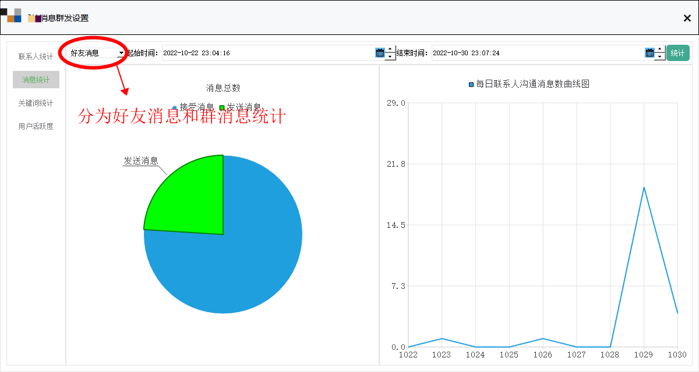  
&emsp;&emsp;1、消息统计可以好友消息统计和群消息统计    
&emsp;&emsp;2、左边圆形图：消息总数，包括某个时间段发送的消息总数和接收的消息总数分别所占比例  
&emsp;&emsp;3、右边折线图：每日消息数量，指的某个时间段每日与联系人沟通的消息总数变化
+    关键词统计  
&emsp;&emsp;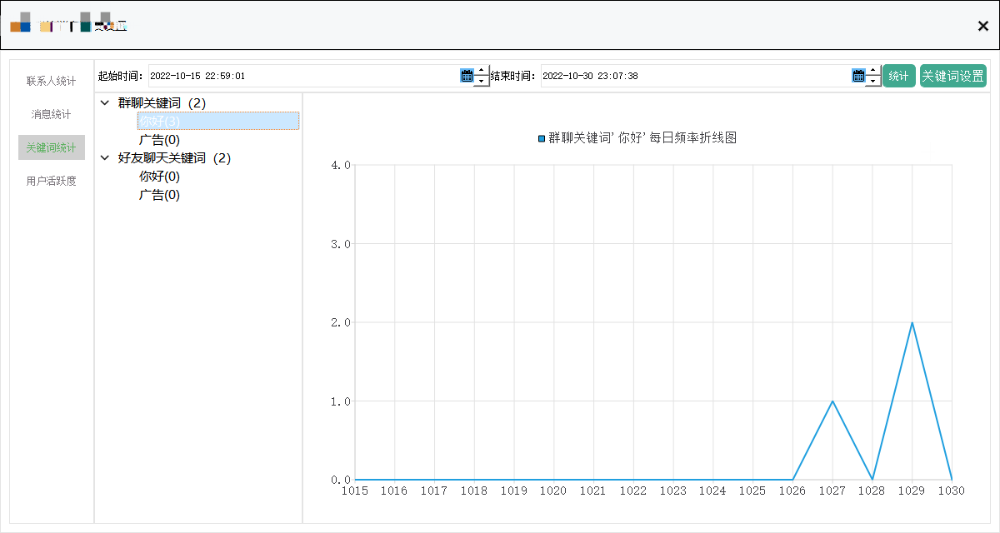  
&emsp;&emsp;1、关键词分为群关键词和好友关键词    
&emsp;&emsp;2、关键词按出现的频率由高到低排列  
&emsp;&emsp;3、点击单一关键词，右边的折线图表示每日该关键词出现次数的变化  
&emsp;&emsp;4、点击“关键词设置”，进行关键词管理：  
&emsp;&emsp;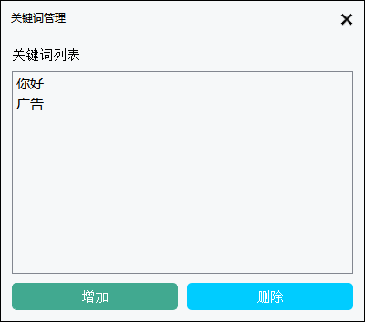  
+    用户活跃度统计  
&emsp;&emsp;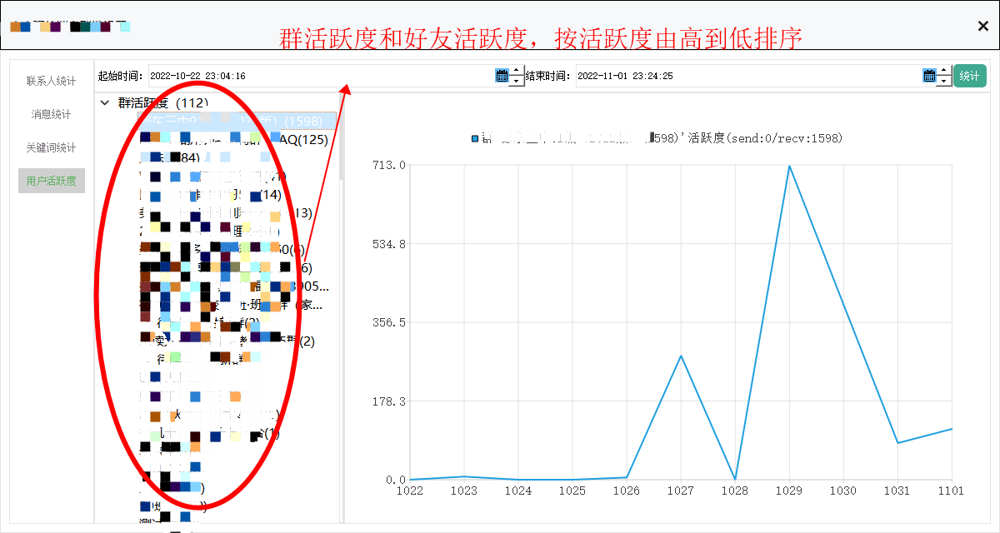  
&emsp;&emsp;1、用户活跃度可以群活跃度和好友活跃度    
&emsp;&emsp;2、好友和群按活跃度由高到低的顺序排列  
&emsp;&emsp;3、点击某一好友或群，右边的折线图表示每日发送和接收消息次数的变化  
### 新好友管理  
+    自动接受  
&emsp;&emsp;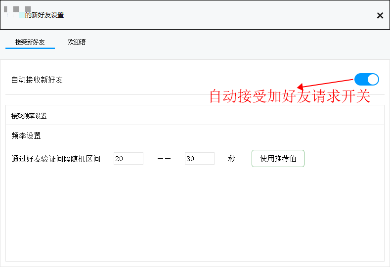  
&emsp;&emsp;1、打开自动接受新好友开关时，当接受加好友的请求时wechatplus会自动同意对方加好友的请求。  
&emsp;&emsp;2、为了被判断为机器人操作，可以设置一个延迟的随机时间，当接受到好友请求时，会自动延迟一个随机的时间，再自动同意好友请求。  
+    欢迎语  
&emsp;&emsp;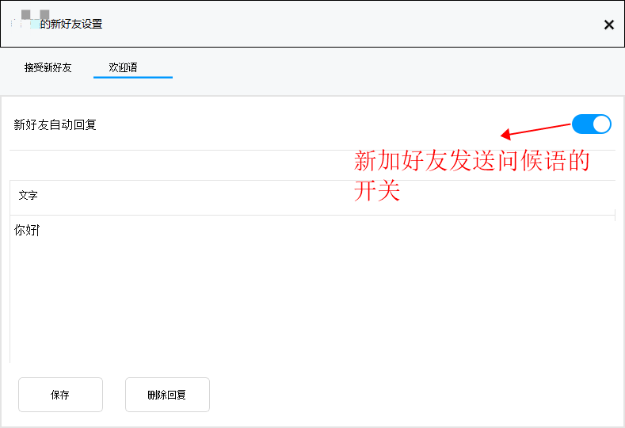  
&emsp;&emsp;打开新好友自动回复开关时，当加了一个新好友，可以自动发送设置好欢迎打招呼的信息。  
### 备注&绑定  
&emsp;&emsp;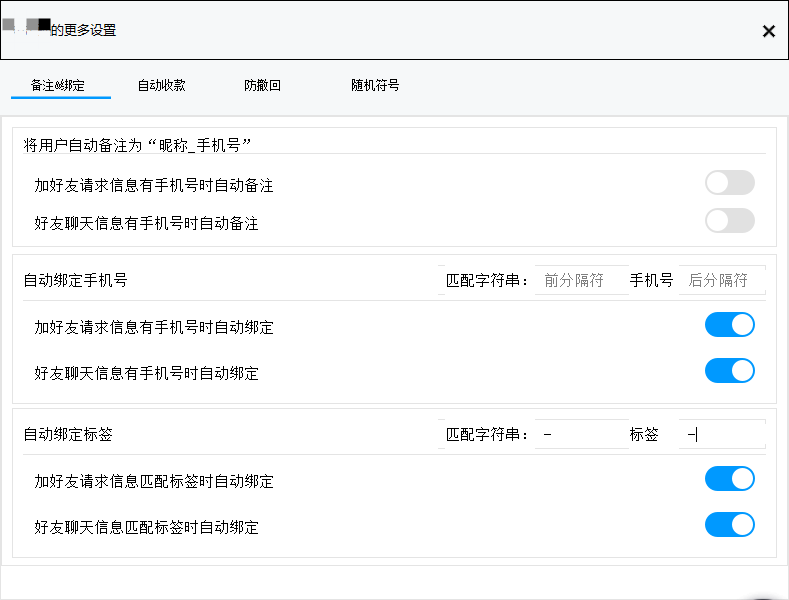  
+    自动备注  
&emsp;&emsp;打开自动备注开关时，会自动将好友备注为"昵称_手机号"的形式。主要可以在两种模式下触发自动备注：  
&emsp;&emsp;1、加好友的请求信息中还有手机号时。  
&emsp;&emsp;2、好友发送过来的聊天信息中带有手机号码时。    
+    自动绑定手机号  
&emsp;&emsp;打开自动绑定手机开关时，会自动绑定好友的手机号码。主要可以在两种模式下触发自动绑定：  
&emsp;&emsp;1、加好友的请求信息匹配设定的手机号码格式时。  
&emsp;&emsp;2、好友发送过来的聊天信息匹配设定的手机号码格式时。  
+    手动绑定手机号  
&emsp;&emsp;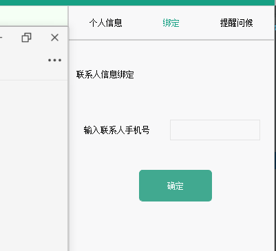  
+    自动绑定标签  
&emsp;&emsp;打开自动绑定标签开关时，会自动将好友归属到对应的好友标签。主要可以在两种模式下触发自动绑定：  
&emsp;&emsp;1、加好友的请求信息匹配设定的好友标签格式时。  
&emsp;&emsp;2、好友发送过来的聊天信息匹配设定的好友标签格式时。  
+    手动绑定标签  
&emsp;&emsp;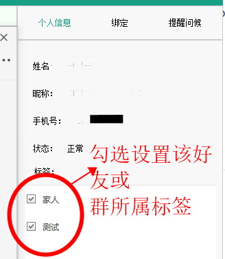  
&emsp;&emsp;选定对应好友，在编辑框输入好友手机号码进行手工绑定。  
### 自动收款  
&emsp;&emsp;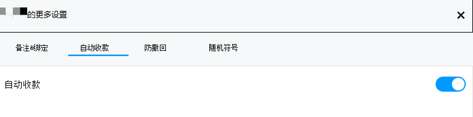  
&emsp;&emsp;打开自动收款开关时，当收到转账汇款时会自动进行收款  
### 防好友消息撤回  
&emsp;&emsp;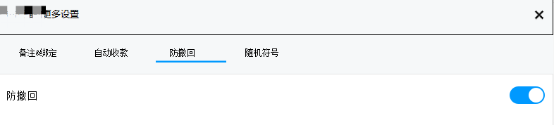  
&emsp;&emsp;打开防撤回功能时，会阻止好友或群成员进行消息撤回，本地能看到对方撤回的消息。  
### 定时提醒问候  
&emsp;&emsp;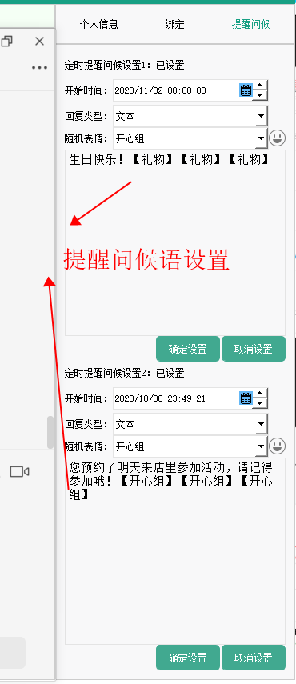  
&emsp;&emsp;每个好友都可以设置两个定时问候语，可以定时发送问候祝福，或者客户预约提醒等等。  
&emsp;&emsp;
### 提供与CRM系统的接口定制  
&emsp;&emsp;根据绑定的手机号码可以对接CRM系统进行扩展开发

