# WeChatPlus  
[toc]  

## 1、介绍  
&emsp;&emsp;WechatPlus是支持PC版微信Wechat的一款辅助工具软件，采用HOOK技术，支持多开、自动回复、群管理、僵尸粉、群发消息、用户数据分析，标签、自动备注，自动绑定手机和标签，自动定时提醒问候用户，自动收款，防撤回等等功能，可以对接企业用户CRM系统，详细功能请参见使用说明，使用场景包括私域运营、客户维护，售后服务等等，所有功能完全免费。
## 2、更新记录  
&emsp;&emsp;2022-9-15 更新到微信最新版 3.7.6.44  
&emsp;&emsp;2022-9-18 增加好友头像功能  
&emsp;&emsp;2022-9-23 优化头像获取方式,增加随机表情设置  
&emsp;&emsp;2022-10-11 增加好友自动打标签功能，解决自动备注和手动绑定手机引起的崩溃  
&emsp;&emsp;2022-10-31 增加随机表情组编辑功能，界面优化
&emsp;&emsp;实时更新中...
## 3、下载  

&emsp;&emsp;下载地址：http://toutiu.com/download/WeChatPlus_3.7.6.44_1.06.rar  

&emsp;&emsp;下载提示为不安全链接时，请在浏览器下载选项中将此链接设为保留 

&emsp;&emsp;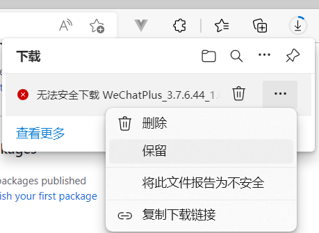  

&emsp;&emsp;如果下载后安装文件杀毒文件提示报警，请将安装文件添加的杀毒软件的信任区  
## 4、安装  
&emsp;&emsp;如果电脑装有杀毒软件，在安装过程或者安装完成后将报警的文件添加到信任，为避免后续杀毒软件误报，请将wechatplus安装目录和微信的安装目录都及时添加到杀毒软件的信任区    

## 5、使用说明   
### 多开  
&emsp;&emsp;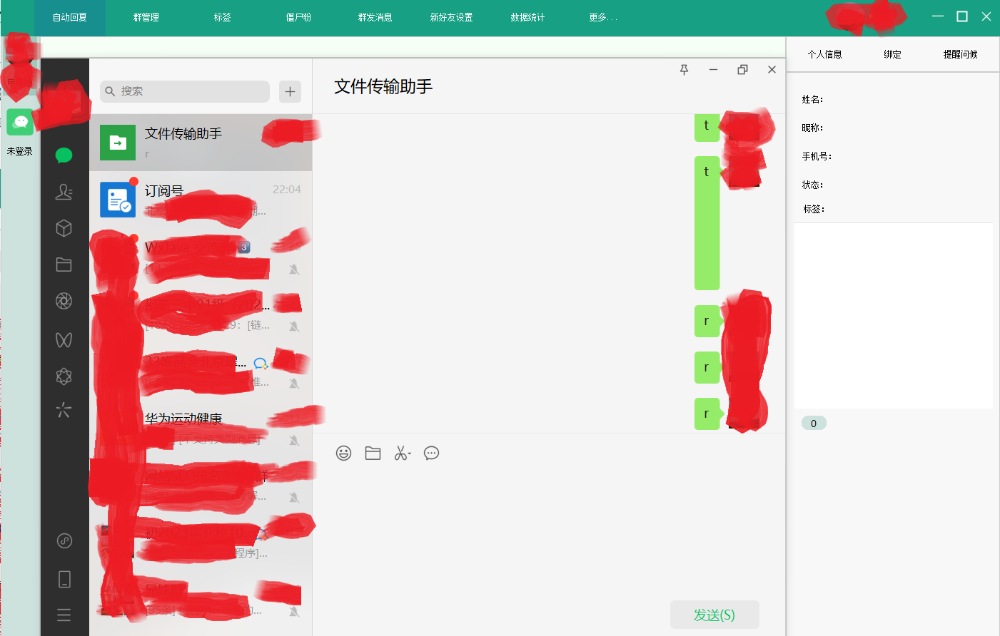  
&emsp;&emsp;独有的防检测技术支持多开  
### 随机符号和表情
&emsp;&emsp;为了防止发送相同消息被检测为机器人，自动发送的消息中可以增加随机字符和随机表情，工具栏“更多”选项，跳出来的设置框中选择随机符号标签  
&emsp;&emsp;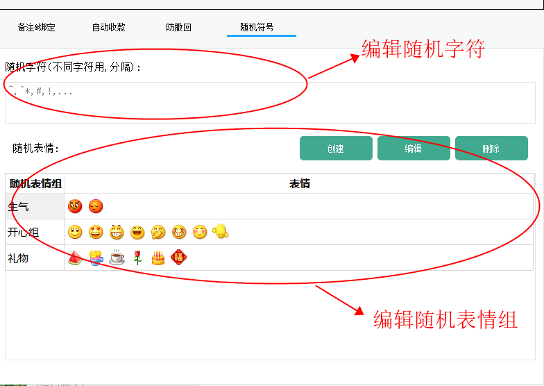  
### 自动回复  
&emsp;&emsp;自动回复氛围快捷键回复和关键词回复，工具栏“自动回复”选项，跳出来的设置框中如下：
+    快捷键回复  
&emsp;&emsp;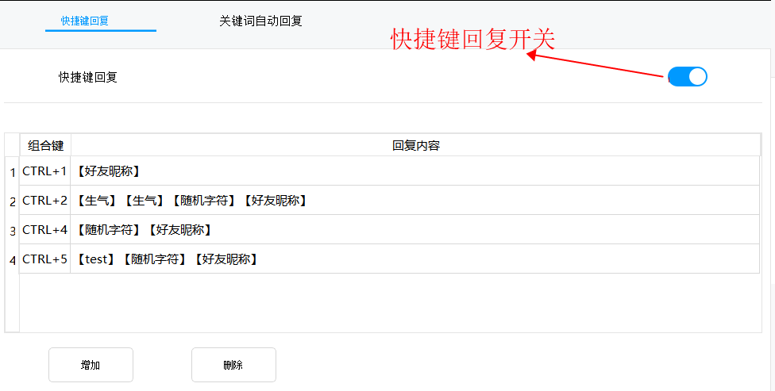  
点击增加按钮，可以增加相应快捷键回复，回复中可以插入随机字符和表情  
&emsp;&emsp;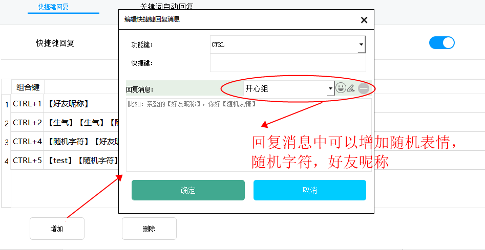  
其中的随机字符和随机表情在上文的随机符号中进行设置
+    关键词回复  
&emsp;&emsp;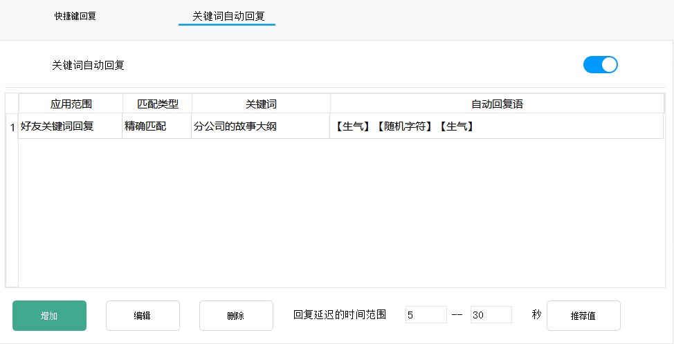  
点击增加或编辑按钮，可以编辑相应关键词回复  
&emsp;&emsp;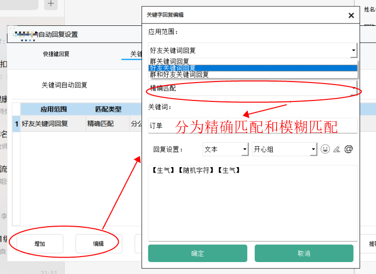  
应用范围：  
1.好友关键词回复：此关键词只能出现在接收的好友消息内容中；  
2.好友关键词：此关键词只能出现在群消息中；  
3.好友关键词：此关键词既能出现在好友消息中，又能出现在群消息中；  
匹配类型：  
1.精确匹配：接受到的消息跟关键词保持一致则触发回复  
2.模糊匹配：接受到的消息内容中含有关键词则触发回复  
### 标签  
+    好友标签  
&emsp;&emsp;对好友进行分类标签，便于群发，查找等  
&emsp;&emsp;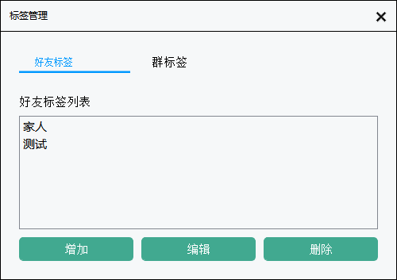  
+    群标签 
&emsp;&emsp;对群进行分类管理  
&emsp;&emsp;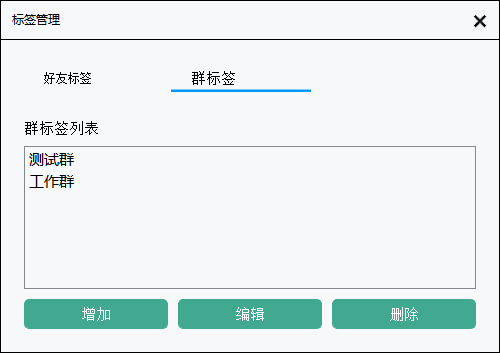  
### 群管理  
&emsp;&emsp;点击工具栏“群管理”选项，进入群管理设置
+    一键拉群  
&emsp;&emsp;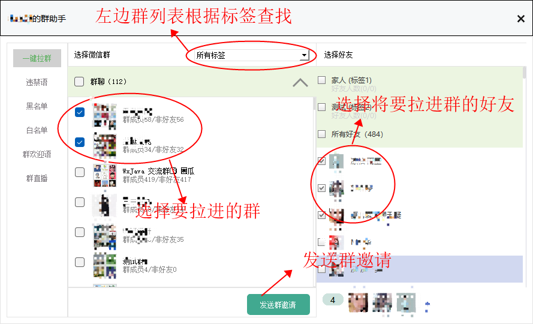  
+    违禁词  
&emsp;&emsp;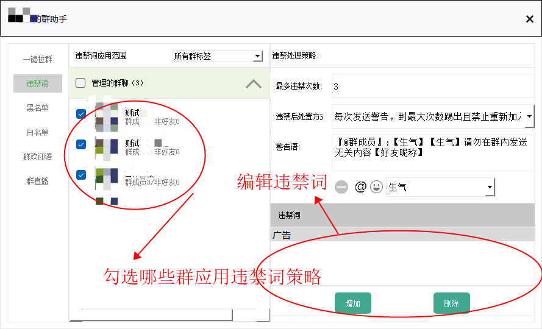  
1.最多违禁次数：允许单一群成员最多发送的违禁词次数。  
2.处置方式：通过相应的处置方式可以实现自动踢人，群成员发送违禁词对应的四种处置方式:  
&emsp;&emsp;(a)、每次发送警告，到最大次数踢出群  
&emsp;&emsp;(b)、每次发送警告，到最大次数踢出且禁止重新加入  
&emsp;&emsp;(c)、每次只发送警告  
&emsp;&emsp;(d)、不处理  
3.警告语：群成员发送违禁词时，发送的群警告语，可以@群成员，可以加入群成员呢称，也可以加入随机表情  
+    黑名单  
&emsp;&emsp;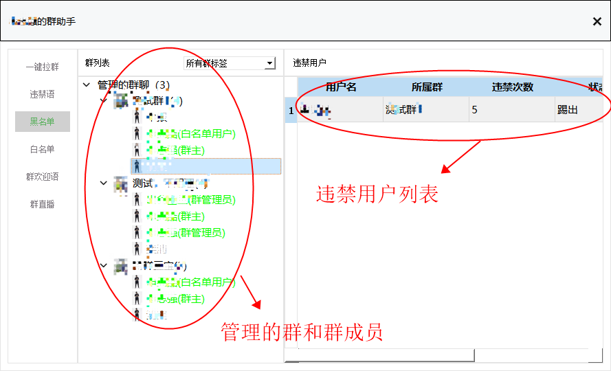  
&emsp;&emsp;群成员列表中绿色成员为群管理员和白名单用户，不受违禁策略的影响，其余群成员可以鼠标右击，弹出菜单踢出该成员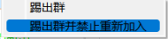  
&emsp;&emsp;黑名单群成员可以在右边列表中鼠标右击移除
+    白名单  
&emsp;&emsp;  
&emsp;&emsp;绿色成员为群管理员和白名单用户，不受违禁策略的影响，其余群成员可以鼠标右击设为白名单用户。  
+    群欢迎语  
&emsp;&emsp;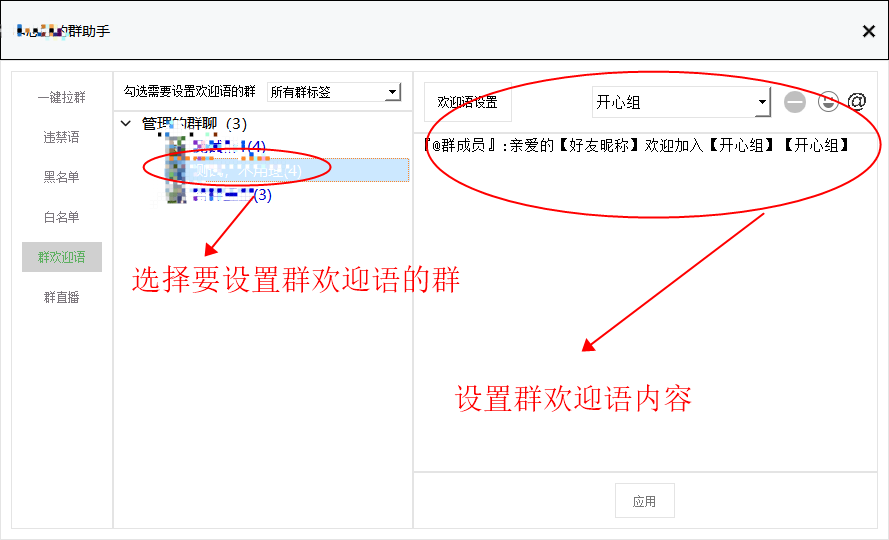  
&emsp;&emsp;群欢迎语，可以@群成员，可以加入群成员呢称，也可以加入随机表情  
+    群直播  
&emsp;&emsp;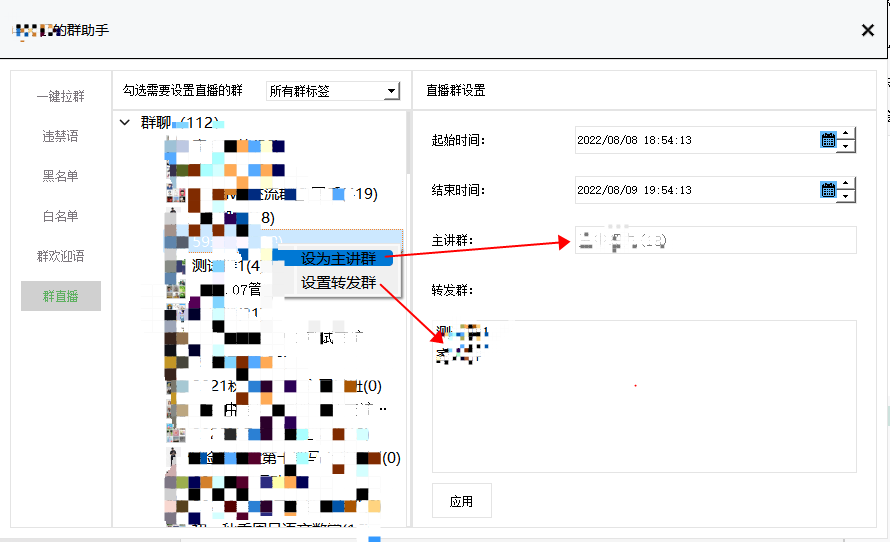  
&emsp;&emsp;群直播实现的是：在一个主讲群发送的消息，在其他转发群进行自动转发。群直播在设置的时间段才有相应功能。  
### 僵尸粉  
点击工具栏“僵尸粉”选项，进入僵尸粉管理：  
&emsp;&emsp;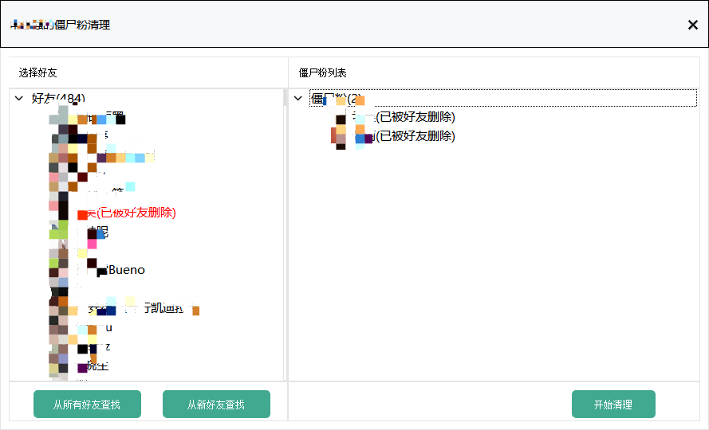  
&emsp;&emsp;左边是所有好友列表，右边是查找出来的僵尸风列表，包括被好友删除和被好友拉黑两种类型。  
+    查找僵尸粉  
&emsp;&emsp;点击“从所有好友查找”，将对所有好友进行查询。  
&emsp;&emsp;点击“从新好友查找”，将只对没查找过的好友进行查询。  
&emsp;&emsp;查找过程中右边僵尸粉列表不会刷新，需要关闭此对话框，重新打开才能看到新查找到的僵尸粉。  
&emsp;&emsp;查找过程中发送的僵尸粉验证消息，好友不会收到，好友完全无感。   
+    清除僵尸粉  
&emsp;&emsp;点击“开始清理，将会对列表中的僵尸粉用户从通讯录好友列表中删除掉，鼠标右击单个僵尸粉用户可以删除单个僵尸粉。   
### 群发消息  
+    即时群发  
&emsp;&emsp;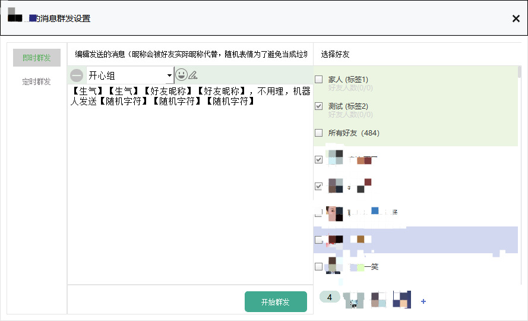  
+    定时群发  
&emsp;&emsp;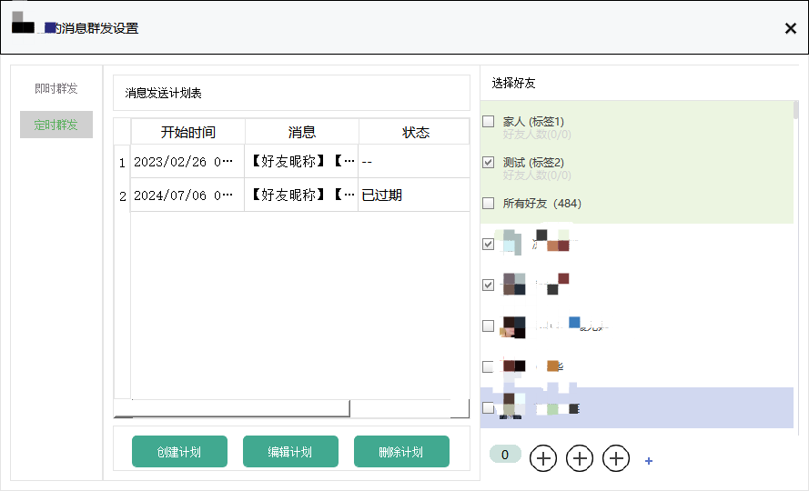  
### 定时提醒问候  
### 数据统计  
+    联系人统计  
+    消息统计  
+    关键词统计  
+    用户活跃度统计  
### 新好友管理  
+    自动接受  
+    欢迎语  
### 自动备注  
### 自动绑定手机号  
### 自动收款  
### 防好友消息撤回  
### 发送消息自动加随机表情和符号  
### 提供与CRM系统的接口定制  

